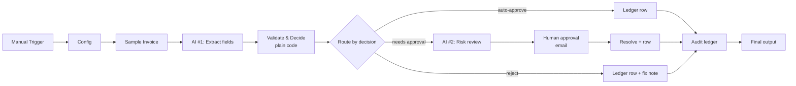

# Invoice Review & Approval — an agentic n8n workflow

This is my submission for the agentic workflow assignment. The workflow takes a raw, messy invoice and turns it into a checked, filed record: the clearly-fine ones get approved automatically, the risky ones go to a human for sign-off, and the broken ones get sent back.

The principle I kept coming back to while building it is simple — let the AI do the *reading*, but never let it do the *deciding*. An LLM is genuinely good at pulling fields out of a chaotic invoice layout, but I don't want it doing arithmetic or deciding whether a bill gets paid. So the AI extracts the data, and ordinary code checks the maths, applies the rules, and routes.

## The problem

Anyone who's done accounts payable at a small company knows the routine. Invoices show up as PDFs in a hundred different layouts. Someone has to read each one, type the numbers into a sheet, check that the line items actually add up to the total, confirm the vendor is one you really work with, and then decide whether it can just be paid or needs a manager to approve it. It's slow and repetitive, and it's exactly the kind of task where a tired person skims past a wrong total and the company ends up overpaying.

So the user I had in mind is an AP clerk or an ops person at a startup or small business. What they want is speed on the boring 90% and a proper check — plus a paper trail — on everything else.

The workflow reads an invoice, pulls out the structured data, independently re-checks the maths and the policy, and then decides one of three things: auto-approve, send to a human, or reject. Every outcome is written to an audit ledger, and anything flagged triggers an approval email. The output is a single, consistent ledger row per invoice (status, vendor, amount, the decision and the reasons for it, who approved it, and a short note).

## How it works

There are basically four stages: an invoice comes in, the AI extracts the fields, deterministic code validates and decides, and then it branches into one of three outcomes, all of which get logged. The whole thing is 15 working nodes, and AI is only used in two of them.

The main nodes, in order:

- **Config** — one place for all the policy: the $5,000 approval threshold, the allowed currencies, the approved-vendor list, and a small tolerance for rounding.
- **Sample Invoice** — holds a few example invoices as raw text (this stands in for what would normally be an email or PDF trigger). Changing `SAMPLE_INDEX` picks which one to run.
- **AI #1: Extract Invoice Fields** — the first AI step. It reads the raw text and returns clean JSON (vendor, invoice number, line items, subtotal, tax, stated total, and a confidence score). I deliberately tell it *not* to do any arithmetic — just copy the numbers exactly as printed.
- **Validate & Decide** — the heart of the workflow, and there's no AI in it. It re-computes the line-item sum and subtotal + tax itself, compares those against the stated total, checks the required fields, the currency, and the vendor list, and then assigns the decision.
- **Route by Decision** — a Switch that sends the invoice down one of three branches based on that decision.
- **AI #2: Risk Review** — the second AI step, only on the approval branch. It writes a short, plain-English summary of why the invoice was flagged, for whoever has to approve it.
- **Human Approval** — a Gmail "send and wait" node. It emails the approver with Approve / Reject buttons and pauses the whole workflow until they click one.
- **Append to Audit Ledger** — writes the final row to a Google Sheet.

There are also small Set/Code nodes that build the ledger row on each branch, and a final node that surfaces the result.

## Where I used AI, and where I didn't

This was the main design decision, so I want to be explicit about it.

| Step | AI or code? | Why |
|------|-------------|-----|
| Pull fields out of messy invoice text | AI | Layouts vary endlessly; this is fuzzy reading, which is what LLMs are actually good at. |
| Re-compute the totals | Code | Arithmetic has to be exact. An LLM can quietly get a sum wrong; `Math` can't. This is what catches overbilling. |
| Required fields / currency / vendor checks | Code | These are rules with one right answer. |
| The threshold and routing decision | Code | "≥ $5,000 needs a human" is a business rule, not a judgement call — it has to be consistent and auditable. |
| The risk summary for the approver | AI | Writing a readable explanation for a person is language generation, where the AI adds something. |
| The rejection note | Code | The deterministic reasons already say what's wrong, so an AI call there would just add cost. |

The example I like best is sample 2. The invoice says the total is $970, and the AI reads it and faithfully reports $970 — exactly what's printed. But the code adds up the line items ($625) plus tax ($45) and gets $670. They don't match, so the invoice is rejected. That's the kind of error a human skims past, and it's also not something I'd trust an LLM to catch reliably — so it lives in code.

## Running it

You'll need a reasonably recent n8n (1.60+ or n8n Cloud). It uses the newer AI / LangChain nodes, so a very old install will show some nodes as "unknown node type" — if that happens, update n8n.

1. Import `invoice-review-workflow.json` into n8n.
2. Open the two "OpenAI Model" nodes and choose an OpenAI credential. On n8n Cloud you can use the free OpenAI credits, so you don't even need your own key. That's the only credential required to watch it run.
3. Open the Sample Invoice node, set `SAMPLE_INDEX` (0–3), and run the workflow.
4. Click "Validate & Decide" to see the decision, and the final node to see the audit row.

The Gmail (approval) and Google Sheets (ledger) nodes ship disabled, so the core logic runs end to end on just an OpenAI key — a disabled node in n8n simply passes its input through. To make them live, add the matching credential and enable the node: for Sheets, point it at a spreadsheet; for Gmail, set the approver's email address.

## The sample invoices

| `SAMPLE_INDEX` | Invoice | What happens | Why |
|:--:|---|---|---|
| 0 | ACME, $371.70 | Auto-approved | Maths fine, known vendor, under the threshold |
| 1 | Dell, $10,680 | Needs approval | Fine otherwise, but it's over the $5,000 threshold |
| 2 | Bright Print, $970 | Rejected | The line items + tax come to $670, not $970 |
| 3 | Nimbus, $3,079.80 | Needs approval | Fine otherwise, but the vendor isn't on the approved list |

Samples 0 and 2 have saved reference outputs in `samples/`. I left 1 and 3 out as exact references because their output includes the AI-written risk note, which isn't identical every run.

## Agentic concepts I used

- **Agent roles** — two of them, an extractor and a reviewer, each doing one job.
- **Structured output** — the extractor returns a fixed JSON shape that the rest of the workflow relies on.
- **Tool use** — Google Sheets for the ledger, Gmail for approvals.
- **Routing** — a Switch picks the branch from the decision.
- **Deterministic checks** — the maths, the threshold, and the currency/vendor lists.
- **Human in the loop** — email approval for anything high-value or off-policy.
- **Fallback handling** — if the AI ever returns something that isn't valid JSON, the code catches it and sends the invoice to manual review instead of crashing.

## Limitations and what I'd do next

- Input is plain text for now. A real version would add an email or Drive trigger and a PDF/OCR step in front of the extractor.
- The thresholds and vendor list live in the Config node. I'd move them into a database or sheet so finance can edit them without touching the workflow.
- There's a single approver. Real AP usually routes to different approvers depending on the amount.
- There's no duplicate-invoice check yet — I'd look up the ledger for the same vendor and invoice number before logging.

## About this submission

This is an individual submission. I designed and built all of it myself — the problem framing, the validation and decision logic, both AI prompts, the routing, and the human approval branch.

## What's in this repo

- `invoice-review-workflow.json` — the workflow; import this into n8n.
- `README.md` — this file.
- `samples/` — the four sample invoices and the reference outputs for samples 0 and 2.
